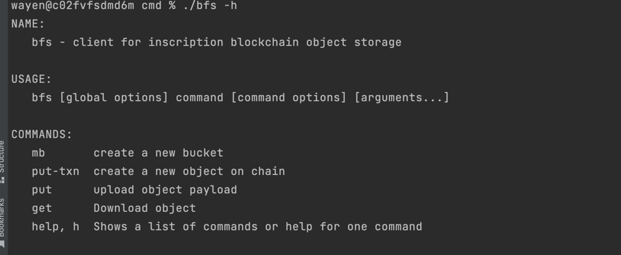

# greenfield-sdk-go


## cmd usage



```
// build:
cd cmd; go build -o bfs main.go cmd_mb.go client_bfs.go   cmd_upload.go  cmd_download.go 
 
// make bucket:
(1) bfs --config config.toml pre-mb s3://bucketname
(2) send txn to chain use comsos client
(3)./bfs --config config.toml  mb s3://bucketname  
    
// putObject:
 
(1) bfs --config config.toml pre-upload s3://bucketname/objectname
(2) send txn to chain use comsos client
(3)./bfs --config config.toml  put --txnhash xxx  test.txt  s3://bucketname/objectname


// download:
./bfs --config config.toml  get s3://bucket1/object1  test.txt  

```
